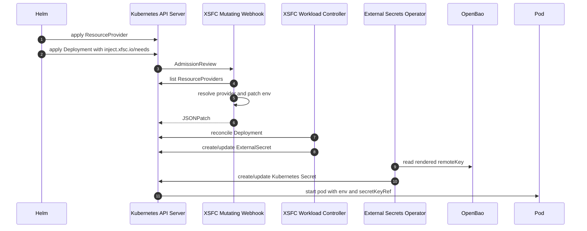

# Design

The operator is intentionally annotation-first for Helm users.

## Removed ResourceBinding

`ResourceBinding` was removed because it forced product charts or tenant tooling to create one extra object for the common case. Most bindings are deterministic:

```text
namespace + workload + needed type -> provider + remoteKeyTemplate
```

## Runtime flow



## Provider resolution

The webhook and controller use the same resolution function:

1. Read pod template annotations.
2. If `inject.xfsc.io/providers` is set, match by provider name or `namespace/name`.
3. Otherwise match `inject.xfsc.io/needs` against `spec.type`.
4. Enforce `spec.allow.namespaces`.
5. Patch static env and secret-backed env.
6. The controller creates ExternalSecrets.

## Secret rule

The operator never creates secret values. It creates only ExternalSecret objects. Credentials must already exist in OpenBao, usually created by tenant management.
