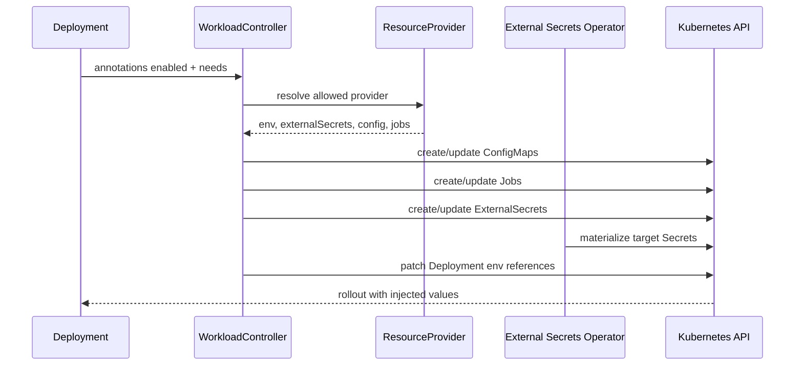
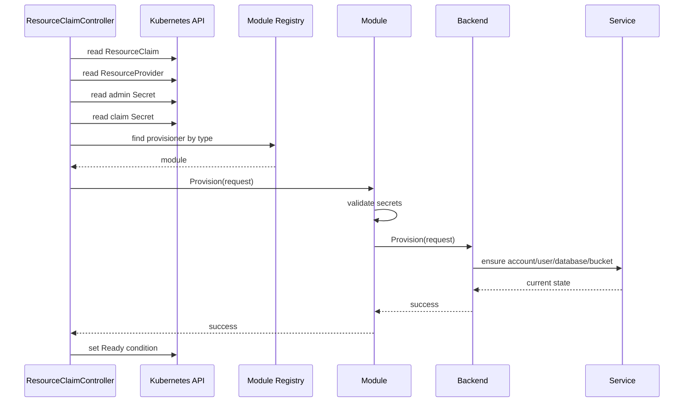
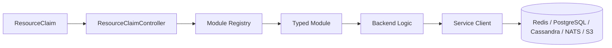

# Eclipse XFSC Kubernetes Operator

The operator has two independent flows: workload injection through `ResourceProvider.outputs`, and backend provisioning through `ResourceClaim` modules.

## Basic Structure
```
ResourceClaim
        │
        ▼
providerRef
        │
        ▼
ResourceProvider
        │
        ├── type: postgres
        ├── adminSecretRef
        │      namespace: infrastructure
        │      name: postgres-root
        │
        ▼
Provisioner
        │
        ├── reads adminSecretRef
        ├── connects as Admin
        └── creates DB/User/Secrets
```

## Injection flow

A workload opts in with annotations:

```yaml
metadata:
  annotations:
    inject.xfsc.io/enabled: "true"
    inject.xfsc.io/needs: "redis,postgres"
    inject.xfsc.io/env-prefix: "APP"
```

A matching `ResourceProvider` can expose four output types:

- `outputs.env`: fixed environment values.
- `outputs.externalSecrets`: an ESO `ExternalSecret` plus injected `secretKeyRef` variables.
- `outputs.config`: a generated `ConfigMap`; its `env` map injects `configMapKeyRef` variables.
- `outputs.jobs`: rendered `batch/v1 Job` YAML created in the workload namespace.

All generated resources are labelled as operator-managed, tracked per provider, updated idempotently and removed when no longer desired. Jobs are always forced into the target namespace. Templates support `.Namespace`, `.Workload`, `.Type`, `.Provider`, and `.Tenant`.



## Full provider example

See [`examples/provider-full-outputs.yaml`](examples/provider-full-outputs.yaml).

```yaml
outputs:
  env:
    REDIS_HOST: redis.redis.svc.cluster.local
  config:
    - nameTemplate: "{{ .Workload }}-redis-config"
      data:
        redis.conf: "timeout 30"
      env:
        REDIS_CONFIG: redis.conf
  externalSecrets:
    - nameTemplate: "{{ .Workload }}-redis"
      targetSecretNameTemplate: "{{ .Workload }}-redis"
      remoteKeyTemplate: "applications/{{ .Namespace }}/{{ .Workload }}/redis"
      secretStoreRef:
        kind: ClusterSecretStore
        name: openbao
      data:
        - envName: REDIS_USERNAME
          property: username
  jobs:
    - nameTemplate: "{{ .Workload }}-bootstrap"
      yaml: |
        apiVersion: batch/v1
        kind: Job
        metadata:
          name: bootstrap
        spec:
          template:
            spec:
              restartPolicy: OnFailure
              containers:
                - name: bootstrap
                  image: busybox
                  command: ["true"]
```

## Provisioning flow

`ResourceClaimController` reads an existing claim secret and the provider admin secret. It then calls the module selected by `spec.type`.





## Developer tests

Run formatting and unit tests:

```bash
gofmt -w api cmd internal
go test ./...
```

Run the module service environment:

```bash
docker compose -f test/integration/docker-compose.yaml up -d --wait
XFSC_INTEGRATION=1 go test -tags=integration ./internal/modules/...
docker compose -f test/integration/docker-compose.yaml down -v
```

Manual verification commands and service ports are documented in [`test/integration/README.md`](test/integration/README.md).

Validate examples and Helm manifests:

```bash
kubectl apply --dry-run=client -f examples/provider-full-outputs.yaml
helm lint deployment/helm
helm template xfsc-operator deployment/helm >/tmp/xfsc-operator.yaml
```

## Existing examples

- `examples/redis-provider.yaml`: Redis injection provider.
- `examples/provider-full-outputs.yaml`: env, ExternalSecret, ConfigMap and Job outputs.
- `examples/workload.yaml`: workload opt-in.
- `examples/*-claim.yaml`: resource provisioning claims.
- `examples/rendered-externalsecret.yaml`: expected ESO output.
